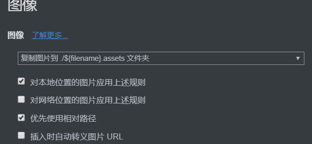

# 删除typora文件中不存在的资源文件

## 使用场景

针对在`.md`中插入的图片资源，会保存到与`.md`同一目录下的`.assets`目录中，但是当我们删除了`.md`文件中的图片资源时，`.assets`目录下不会自动清理该资源，因此会导致占用空间增多。

**资源文件存放位置**

确保`.assets`与`.md`存放在同一目录，且命名相同（例如：`aa.md`和`aa.assets`，且两者在同一目录下）。`建议直接将typora偏好设置为`：

## 使用方法

- 运行`typora-del.jar`
- 会提示输入路径，这个路径是包含了`.md`文件的`目录`，并且允许该目录下面存在子目录，子目录里也可以包含`.md`文件