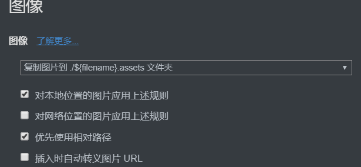

# 删除typora文件中不存在的资源文件

## 使用场景

针对在`.md`中插入的图片资源，会保存到与`.md`同一目录下的`.assets`目录中，但是当我们删除了`.md`文件中的图片资源时，`.assets`目录下不会自动清理该资源，因此会导致占用空间增多。

**资源文件存放位置**

确保`.assets`与`.md`存放在同一目录，且命名相同（例如：`aa.md`和`aa.assets`，且两者在同一目录下）。`建议直接将typora偏好设置为`：



## 使用方法

### Python 版本（强烈推荐）✨

**运行环境：**

- Python 3.6+
- 依赖：tqdm, colorama（首次运行需安装）

**唯一入口：**

```bash
cd src-py

# 首次运行安装依赖
pip install -r requirements.txt

# 智能模式：自动识别文件/目录，支持进度条、彩色输出、详细日志
python typora_del_unified.py <path>

# 交互模式
python typora_del_unified.py
```

**功能特性：**

- ✅ **唯一入口**：`typora_del_unified.py` 是唯一入口文件
- ✅ 智能路径识别：自动判断输入是文件还是目录
- ✅ **统计预览**：处理前显示详细统计信息（文件数、图片数等）
- ✅ **用户确认**：处理前询问确认，避免误操作
- ✅ 进度条显示：实时显示处理进度和预计剩余时间
- ✅ 彩色输出：成功/警告/错误使用不同颜色
- ✅ 详细报告：操作完成后显示完整统计信息
- ✅ 持久化日志：所有操作记录保存到 `log/` 目录，可追溯历史

**使用示例：**

```bash
# 处理单个文件
python typora_del_unified.py article.md

# 处理整个目录
python typora_del_unified.py ./blog/

# 交互模式（可连续处理多个文件）
python typora_del_unified.py
# 然后拖拽文件或目录
```

**查看日志：**

```bash
# 所有操作日志保存在 src-py/log/ 目录
ls src-py/log/
```

***

### Java 版本（原始版本）（已经没更新）

- 运行 `typora-del.jar`
- 会提示输入路径，这个路径是包含了 `.md` 文件的 `目录`，并且允许该目录下面存在子目录，子目录里也可以包含 `.md` 文件

